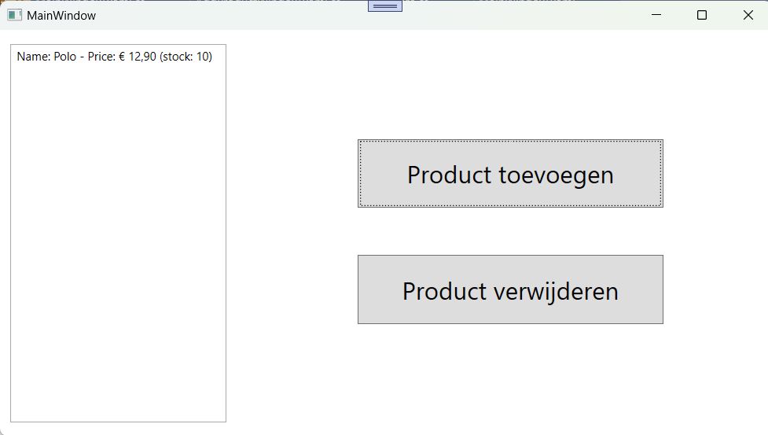
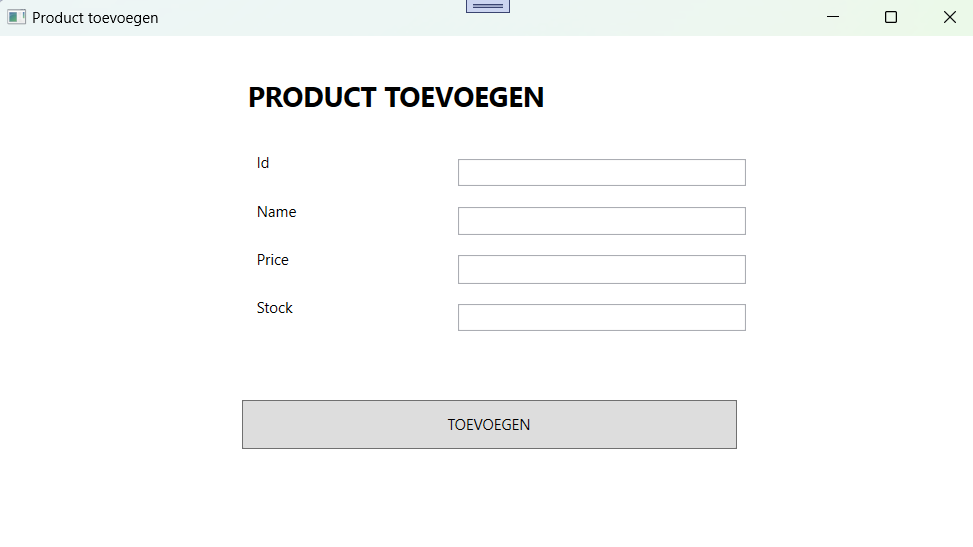

# Voorraadbeheer
### Opdracht:
Ontwikkel een applicatie om een lijst met producten te beheren. Maak hiervoor gebruik van een eigen class om de productinformatie te modelleren.

### Vereisten:
##### Product Class:
Maak een class Product met properties zoals ID, Name, Price en Stock.
##### Hoofdvenster:
Toon een overzicht (bijvoorbeeld met een ListBox) van alle producten.
Voeg een knop "Product toevoegen" toe.
Voeg een knop "Product verwijderen" toe.
##### Modal Venster voor Toevoegen:
Bij klikken op "Product toevoegen" opent een modal venster waarin de gebruiker gegevens kan invoeren voor een nieuw product.
Na invoer, wordt een nieuw Product-object aangemaakt en aan de lijst in het hoofdvenster toegevoegd.
##### Product verwijderen
Wanneer je een item in de ListBox selecteerd en op de knop 'Product verwijderen' klikt, wordt deze uit de lijst verwijderd.
##### Validatie:
Implementeer basisvalidaties, zoals dat de prijs positief moet zijn en de voorraad niet negatief.

##### Vereisten & Tips
Maak gebruik van een Static-class 'Data' voor de producten.